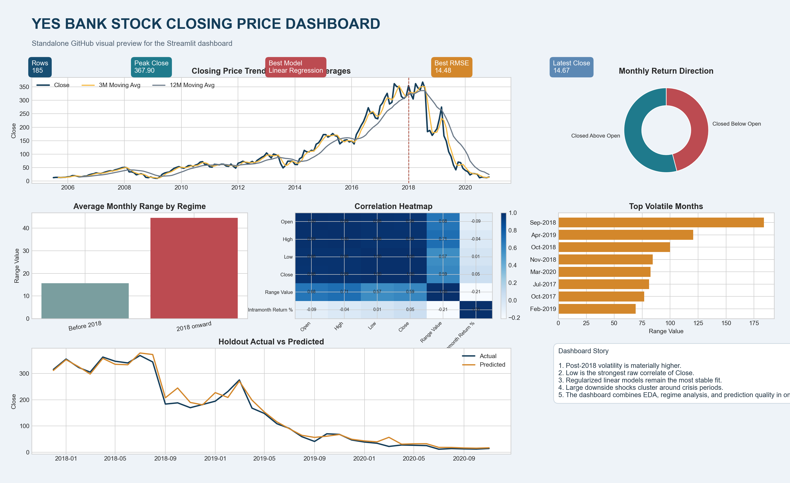

# Dashboard Preview

This folder is the **visual dashboard deliverable** for the standalone Yes Bank project.

Instead of asking a reviewer to open Python source first, the repository now exposes the dashboard as a diagram-style preview image:

## What This Diagram Shows

- monthly closing price trend with moving averages
- return direction split
- regime comparison before and after 2018
- correlation heatmap
- top volatility months
- holdout actual vs predicted comparison
- a short insight panel summarizing the outcome

## Related Files

- Streamlit app entry: [app.py](../app.py)
- Dashboard rendering module: [dashboard_view.py](../dashboard_view.py)
- Notebook used for the project story: [Yes_bank_stock_closing_price_prediction.ipynb](../Yes_bank_stock_closing_price_prediction.ipynb)
